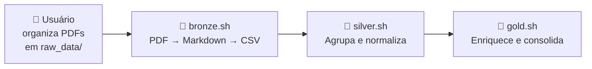
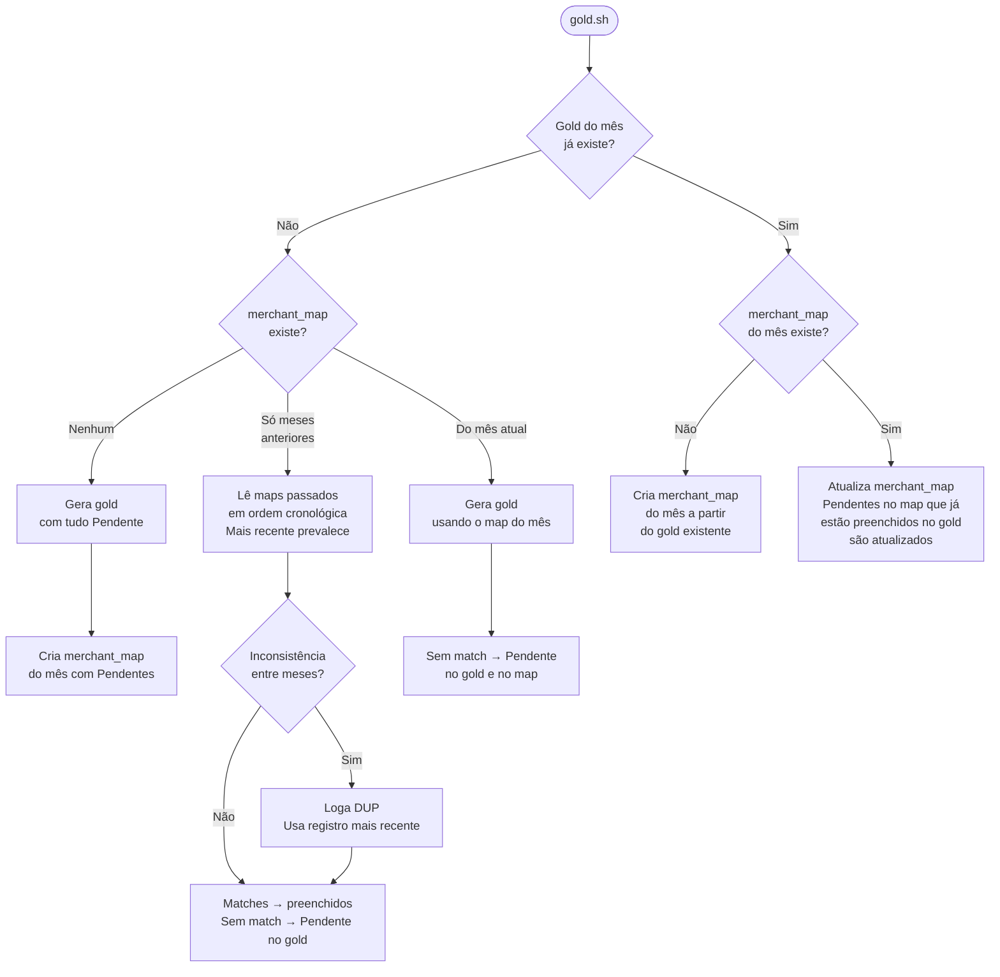
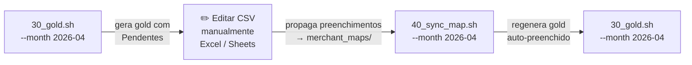

# extrato-pipeline

Converte extratos bancários em PDF em CSVs estruturados e categorizados por mês.

## Pipeline principal



## Lógica do gold



## Ciclo de enriquecimento manual



> `40_sync_map.sh` ignora entradas Pendente e substrings listadas em `nao_mapear.csv`.

---

## Estrutura de dados

```
data/
  raw_data/{owner}/{bank}/{account_type}/*.pdf     ← entrada (gitignored)
  markdown/{owner}/{bank}/{account_type}/*.md      ← cache intermediário (gitignored)
  bronze/{owner}/{bank}/{account_type}/*.csv       ← um CSV por conta/mês
  silver/{owner}/*.csv                             ← schema unificado
  gold/{owner}/{YYYY-MM}.csv                       ← saída final enriquecida
  merchant_maps/
    nao_mapear.csv                                 ← substrings a nunca auto-mapear
    {YYYY-MM}.csv                                  ← mapeamentos por mês
```

## Comandos

```bash
# Pipeline completa
bash scripts/00_full.sh [--owner X] [--month YYYY-MM]

# Camadas individuais
bash scripts/10_bronze.sh [--owner X]
bash scripts/20_silver.sh [--owner X]
bash scripts/30_gold.sh   [--owner X] [--month YYYY-MM]
bash scripts/40_sync_map.sh [--owner X] [--month YYYY-MM]
```

> `--month` só filtra gold e sync_map. Bronze e silver processam todos os meses do owner.

---

## Schemas

### Gold (`data/gold/{owner}/{YYYY-MM}.csv`)

| coluna | descrição |
|---|---|
| `data` | data da transação (YYYY-MM-DD) |
| `nome_original` | nome exato do extrato |
| `nome_simplificado` | nome legível (ou `Pendente`) |
| `categoria` | categoria de gasto (ou `Pendente`) |
| `valor` | valor em BRL (negativo = despesa) |
| `origem` | banco e tipo de conta |
| `situacao` | `avista`, `parcelado` ou vazio (débito) |
| `parcela_atual` | número da parcela atual |
| `parcelas_total` | total de parcelas |

### merchant_maps (`data/merchant_maps/{YYYY-MM}.csv`)

| coluna | descrição |
|---|---|
| `nome_original` | substring do nome original (case-insensitive) |
| `nome_simplificado` | nome simplificado a aplicar (ou `Pendente`) |
| `categoria` | categoria a aplicar (ou `Pendente`) |

---

## Adicionar novo banco

1. Criar `src/extractors/{banco}_{tipo}.py` com `parse_markdown(text: str, competencia: str) -> pd.DataFrame`
2. Registrar no dict `EXTRACTORS` em `src/bronze.py`

## Dependências

```bash
pip install pymupdf4llm pandas
```
